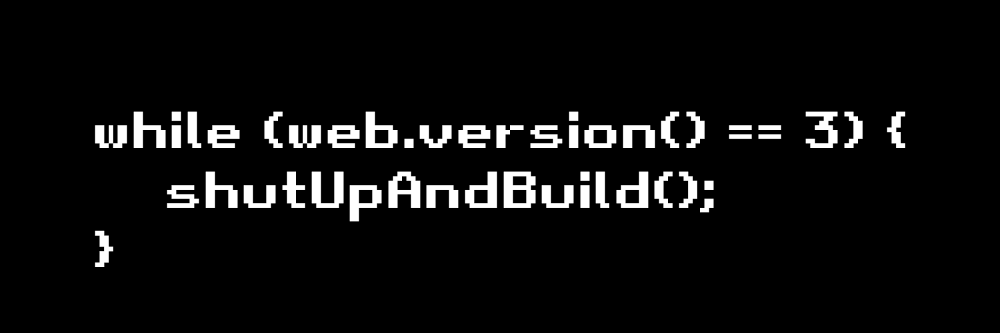

# Getting Started



Wraith Works contracts are a set of Solidity smart contracts to help streamline the development process for commonly used patterns, as well as providing other innovative ideas that can be adopted by the community.

## Installation

Our contracts are deployed to npmjs, and the following commands can be used to install in your project.

!!! npm
    ```bash
    npm i @wraith-works/contracts
    ```

!!! yarn
    ```bash
    yarn add @wraith-works/contracts
    ```

## Usage

Utilizing the contracts in your project is simple:

```solidity
import "@wraith-works/contracts/tokens/ERC721/BaseERC721.sol";
```

### Example Contract

```solidity
pragma solidity ^0.8.19;

import "@wraith-works/contracts/tokens/ERC721/AirdropERC721.sol";
import "@wraith-works/contracts/tokens/ERC721/RevealableERC721.sol";

contract MyNFT is AirdropERC721, RevealableERC721 {
    constructor()
        BaseERC721(
            "MyNFT",
            "NFT",
            "https://example.com/",
            ".json",
            3333,
            0x14c84F8aBaD55F074Ef18BEb46A7cbede6a17B10,
            750
        )
        RevealableERC721("https://example.com/prereveal.json")
    {}

    function tokenURI(uint256 _tokenId) public view override(BaseERC721, RevealableERC721) returns (string memory) {
        return RevealableERC721.tokenURI(_tokenId);
    }
}
```

## Testing

Each contract has an associated test case in `test/`. Follow these steps to run the tests:

1. Install dependencies with `yarn install`.
2. Run the tests with `yarn test`.

### Example Output

```bash
BaseERC721 airdrop contract test
  ✓ BaseERC721 airdrop security checks
  ✓ Can airdrop total supply

BaseERC721 contract test
  ✓ Deployment should succeed
  ✓ Deployment with max supply should succeed
  ✓ BaseERC721 security checks
  ✓ Can pause and unpause contract
  ✓ Mint fails when paused
  ✓ Unlimited mint more than one
  ✓ Max supply mint more than one
  ✓ Max supply mint total supply
  ✓ Correct tokenURI

BaseERC721 revealable contract test
  ✓ Deployment should succeed
  ✓ BaseERC721 revealable security checks
  ✓ tokenURI returns prereveal URI
  ✓ tokenURI returns URI for token when revealed

·--------------------------------------------|---------------------------|-------------|-----------------------------·
|            Solc version: 0.8.19            ·  Optimizer enabled: true  ·  Runs: 200  ·  Block limit: 10000000 gas  │
·············································|···························|·············|······························
|  Methods                                   ·              175 gwei/gas               ·       0.84 usd/matic        │
·························|···················|·············|·············|·············|···············|··············
|  Contract              ·  Method           ·  Min        ·  Max        ·  Avg        ·  # calls      ·  usd (avg)  │
·························|···················|·············|·············|·············|···············|··············
|  AirdropERC721Mock     ·  airdrop          ·    3840483  ·    3846083  ·    3846028  ·          101  ·       0.57  │
·························|···················|·············|·············|·············|···············|··············
|  AirdropERC721Mock     ·  unpause          ·          -  ·          -  ·      27773  ·            2  ·       0.00  │
·························|···················|·············|·············|·············|···············|··············
|  ERC721Mock            ·  mint             ·     608674  ·    3841655  ·    3748345  ·          104  ·       0.55  │
·························|···················|·············|·············|·············|···············|··············
|  ERC721Mock            ·  pause            ·          -  ·          -  ·      27757  ·            1  ·       0.00  │
·························|···················|·············|·············|·············|···············|··············
|  ERC721Mock            ·  setBaseURI       ·          -  ·          -  ·      31226  ·            1  ·       0.00  │
·························|···················|·············|·············|·············|···············|··············
|  ERC721Mock            ·  unpause          ·          -  ·          -  ·      27773  ·            5  ·       0.00  │
·························|···················|·············|·············|·············|···············|··············
|  RevealableERC721Mock  ·  mint             ·          -  ·          -  ·     147925  ·            1  ·       0.02  │
·························|···················|·············|·············|·············|···············|··············
|  RevealableERC721Mock  ·  setPrerevealURI  ·          -  ·          -  ·      40758  ·            1  ·       0.01  │
·························|···················|·············|·············|·············|···············|··············
|  RevealableERC721Mock  ·  toggleReveal     ·          -  ·          -  ·      45643  ·            1  ·       0.01  │
·························|···················|·············|·············|·············|···············|··············
|  RevealableERC721Mock  ·  unpause          ·          -  ·          -  ·      27773  ·            1  ·       0.00  │
·························|···················|·············|·············|·············|···············|··············
|  Deployments                               ·                                         ·  % of limit   ·             │
·············································|·············|·············|·············|···············|··············
|  AirdropERC721Mock                         ·          -  ·          -  ·    2254114  ·       22.5 %  ·       0.33  │
·············································|·············|·············|·············|···············|··············
|  ERC721Mock                                ·    2192295  ·    2192319  ·    2192317  ·       21.9 %  ·       0.32  │
·············································|·············|·············|·············|···············|··············
|  RevealableERC721Mock                      ·          -  ·          -  ·    2350328  ·       23.5 %  ·       0.35  │
·--------------------------------------------|-------------|-------------|-------------|---------------|-------------·

15 passing (2m)
```
